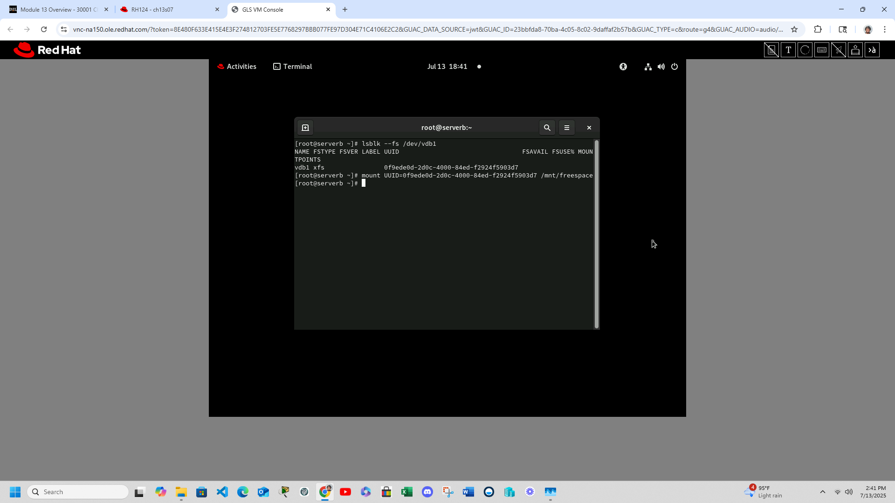
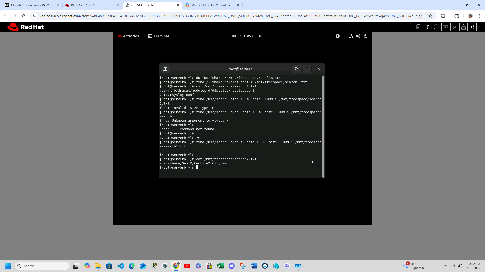
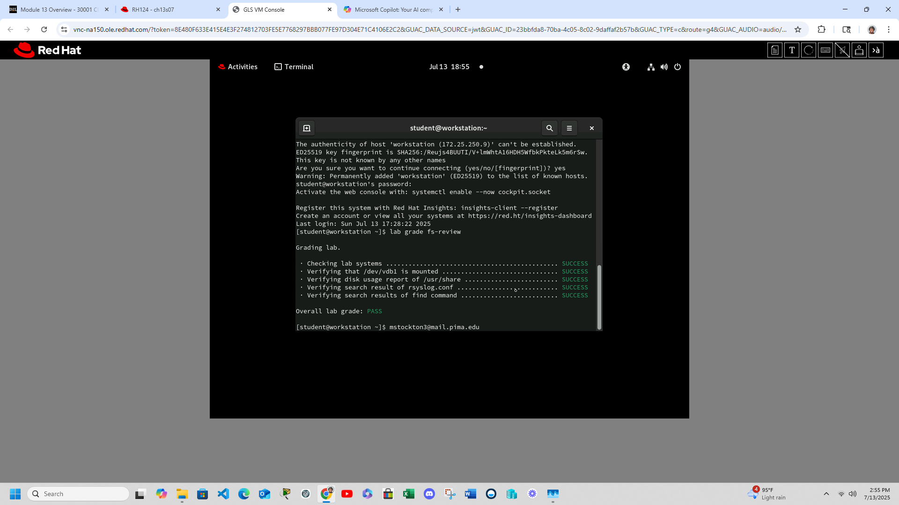

# redhat-rh124-lab
Hands-on lab documentation from Red Hat RH124, showcasing system administration tasks including filesystem management, UUID-based mounting, disk usage logging, and advanced file discovery techniques. Built in a virtualized Linux environment with real-world command-line workflow ideal for help desk Tier 2 and sysadmin roles.

## Filesystem Mount Verification

## Disk Usage Logging

## Lab Completion Status

